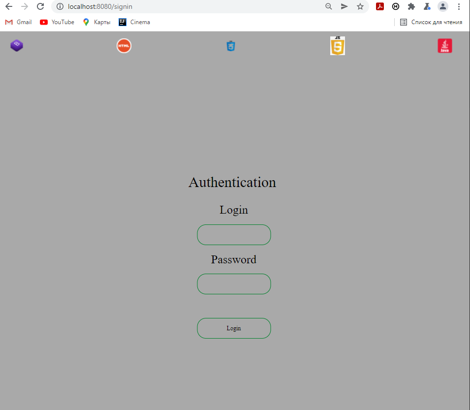
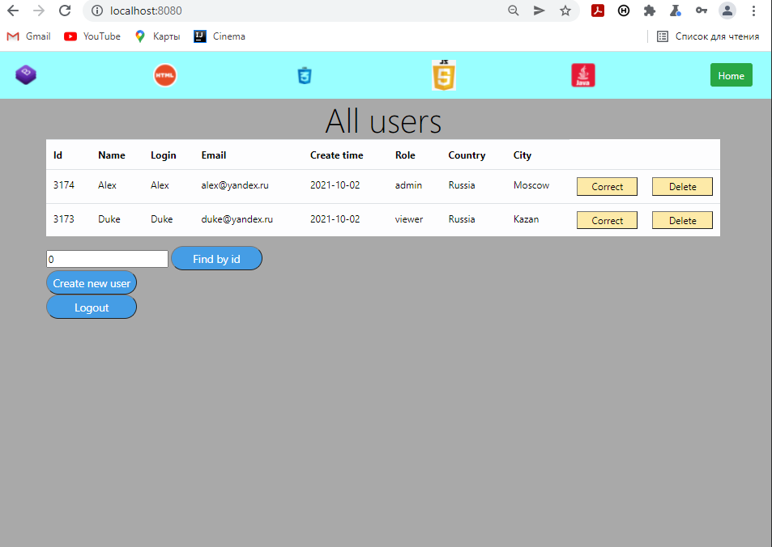
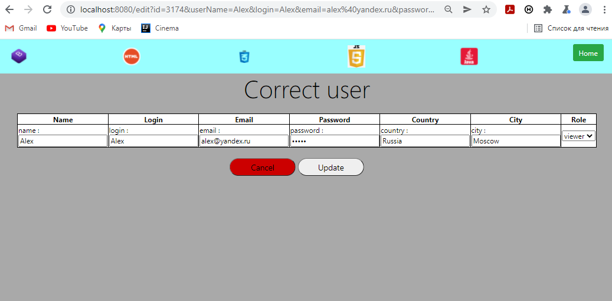
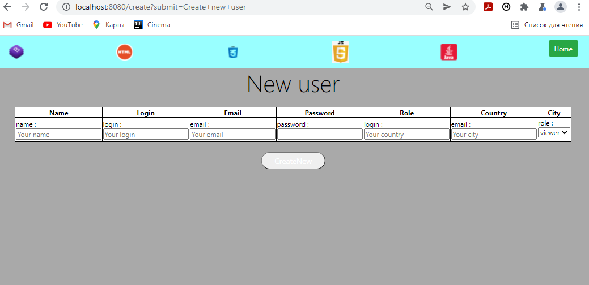
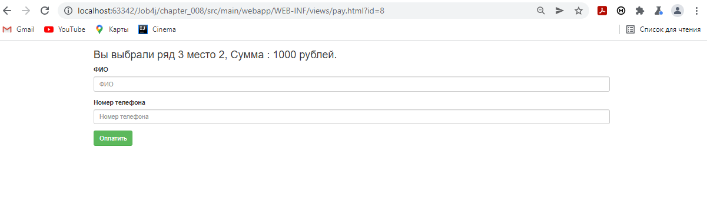
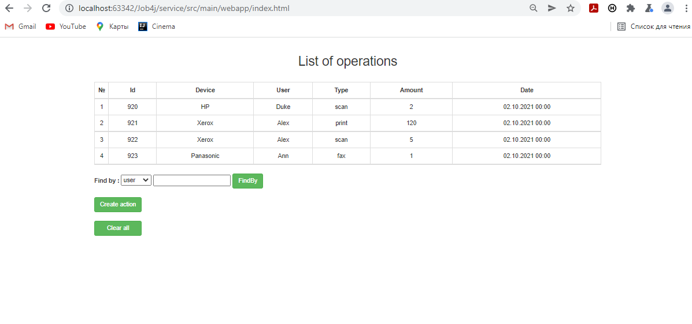
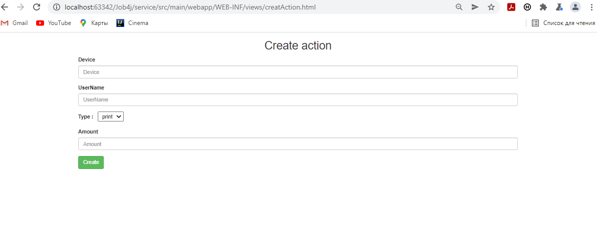

# [Job4j](https://job4j.ru)
## Изучения Java c нуля Java SE + EE.
Основная задача курса - это изучить и научиться применять основные технологии, которые используются в разработки на языке Java, необходимых для трудоустройства на позицию Junior Java Developer.
## Состав курса: 

### Инструменты:
IntelliJ Idea, Maven, jUnit, Git, Mockito, liquibase, Tomcat, PostgreSQL, JConsole.

### [Синтаксис языка](chapter_001/src/main/java/ru/job4j):
   JVM, Типы данных, Операторы (условия, сравнения, логические), Тернарный оператор, Циклы (For, Foreach), Массивы.
### [ООП](chapter_002/src/main/java/ru/job4j):
   Наследование, Инкапсуляция, Полиморфизм, Внутренние классы, Анонимные классы, Абстрактные классы, Интерфейсы, Исключения.
### [Коллекции Lite](chapter_003/src/main/java/ru/job4j):
   Collections Framework, Коллекции List, Set, Map, Generic.
### [Коллекции Pro](chapter_004/src/main/java/ru/job4j):
   Параметризованные типы, Wildcard, Итераторы, Внутреннее устройство: Коллекции List, Коллекции Stack, Queue, Коллекции Set, Коллекции Map, Структуры Tree, Hashcode, equals, Временная сложность при поиске/вставке/удалении, Lambda, Stream API, Сортировка.
### [SQl, JDBC](chapter_006/src/main/java/ru/job4j):
   Базовый синтаксис SQL, Типы данных, Создание базы данных/таблиц, Запросы Select, Left/Right/Inner Join, Group By, Order By, внешние ключи, естественные ключи, Связывание таблиц (One to One / One to Many / Many to Many).
### [Ввод-вывод, Socket](chapter_009/src/main/java/ru/job4j) :
   InputStreams, OutputStreams, Readers, Writers, Scanner, Файловые менеджеры.
### [Многопоточность](chapter_005/src/main/java/ru/job4j):
   Синхронизация ресурсов, JMM, Потокобезопасные коллекции, Неблокирующие алгоритмы.
### [ООД](chapter_010/src/main/java/ru/job4j):
   Принципы SOLID, Разработка через тестирование (TDD).
### [Память](chapter_011/src/main/java/ru/job4j):
   Сборщик мусора, Типы сборщиков, Профилирование приложений.
### [SOLID](chapter_010/src/main/java/ru/job4j):
   Принципы SOLID, Разработка через тестирование (TDD)
### [Клиент-серверное приложение](chapter_007/src/main/java/ru/job4j):
   Общая схема клиент-серверного приложения, Протоколы HTTP и HTTPS, Servlet, JSP, MVC, JSLT, Filter, Session, Auth, Клиентские языки HTML, JS, CSS, Тестирование Mockito.
      
   На основе полученных знаний по клиент-серверным приложениям, был разработан [проект Web приложение](chapter_007/src/main/java/ru/job4j) по работе с пользователями.
   При открытии стартовой страницы, необходимо будет пройти авторизацию.  
     
      
   
   После прохождения авторизации пользователю открывается стартовая страница, в приложении установлено несколько ролей (Admin, Viewer).    
   Роли имеют различный функциональный набор, в зависимости от присвоенной роли пользователю будет открыт доступ к своему аккаунту (Viewer), либо список со всеми зарегистрированными аккаунтами (Admin).   
   
     
   
   Админу разрешено редактировать любой аккаунт, обычному пользователю только свой. 
   
     
   
   Админу разрешено создавать новые аккаунты, обычный пользователь не имеет такой возможности. 
   
        
   
   В ходе разработки данного приложения использовались следующие инструменты:
   * java
   * jsp
   * servlets
   * filter
   * session
   * postgresql
   * jstl
   * js
   * ajax
   * jquery
   * bootstrap
   * mockito
   ----
   ### [Онлайн кинотеатр](chapter_008/src/main/java/ru/job4j)
   Вторым разработанным проектом по клиент-серверным приложениям был онлайн кинотеатр, который позволяет в режиме онлайн видеть доступные места на сеанс: 
   
   
   Приложение позволяет бронировать и покупать билеты на сеанс:
   
   
   В ходе разработки данного приложения использовались следующие инструменты:
   * java
   * servlets
   * session
   * postgresql
   * js
   * ajax
   * jquery
   * bootstrap
   * mockito
   ----
   ### [Сервис по контролю персонала](service/src/main/java/ru/job4j)
   Следующим разработанным проектом был сервис по контролю персонала. Данный сервис позволяет отслеживать всю активность, а также устанавливать фильтры по просмотру активности:
   
   
   Позволяет добавлять активность с устройств, указывать имя сотрудника и тип операции.
   
   
   В ходе разработки данного приложения использовались следующие инструменты:
   * java
   * servlets
   * postgresql
   * js
   * ajax
   * jquery
   * bootstrap   

